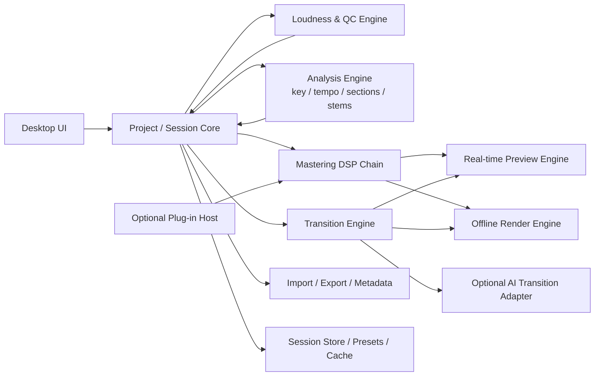

# Standalone Audio Mastering App for a Private Project

## Executive summary

The strongest product opportunity is **not** to build “another auto-mastering plugin,” but to build a **focused album-finishing workstation**: a native desktop app that combines mastering, album sequencing, gapless playback, inter-track transitions, loudness compliance, codec auditioning, and high-confidence export workflows. The market already covers single-track AI mastering well through desktop suites such as urlOzone 12 Advancedturn16search4 and dedicated editors such as urlWaveLab Pro 13turn16search1, plus online services such as urlLANDRturn16search10, urleMasteredturn16search3, and urlBandLab Masteringturn17search16. What is less well covered is the workflow between “finished mixes” and a coherent continuous album master, especially when the project needs album-normalized loudness, transitions, stem-aware fixes, and clean platform-specific delivery. citeturn16search4turn16search1turn16search10turn16search3turn17search16turn10search7turn5view0

For a private project, the most defensible MVP is a **deterministic DSP-first product** with optional AI modules later. The app should implement a standards-aligned loudness pipeline based on urlAESTD1008turn10search0 and urlEBU R 128turn14search5, render internally at high precision, preview lossy-codec consequences, and export native-resolution masters instead of chasing arbitrary one-size-fits-all LUFS numbers. Official platform guidance is remarkably consistent on a few essentials: keep the native master resolution, avoid unnecessary downsampling or bit-depth reduction before delivery, and protect against clipped transcoding with conservative true-peak ceilings. citeturn11view0turn14search5turn14search0turn5view0turn4view0turn12view0turn13view1turn7search0turn7search2turn15search10

My recommendation is to target **macOS and Windows first**, using a **C++ native app centered on urlJUCEturn19search0**, with offline rendering as the primary path and real-time preview as a secondary path. Use a mastering engine that can operate in album mode, track mode, and stem-assisted mode; add a transition engine that begins with crossfades, beat/key/tempo matching, gap handling, spectral-tail matching, and optional sample-based linking material; then add cloud or self-hosted generative transition experiments only after the non-ML path is excellent. That ordering minimizes legal risk, compute burden, and UX ambiguity while still leaving room for ambitious AI later. citeturn19search0turn10search7turn5view0turn17search3

## Scope, assumptions, and the market landscape

The brief leaves OS targets, team size, and budget unspecified. For planning purposes, the most practical interpretation is a **single-user or small-team desktop tool** for stereo album delivery, with optional stems and optional AI transition generation. Under that assumption, the design center should be: eight-song album projects, strong recall, rapid batch renders, codec preview, and easy switching between “competitive streaming,” “album-consistent,” “vinyl premaster,” and “CD/DDP-ready” output modes. This is an inference from the requested scope rather than a published requirement. 

The commercial landscape falls into four buckets. First are **desktop mastering suites**: urlOzone 12 Advancedturn16search4 is sold as a modular mastering suite at $499, and urlWaveLab Pro 13turn16search1 is listed at $499.99. Second are **algorithmic online mastering services**: urlLANDRturn16search10 offers free previews and paid downloads, with published messaging around album mastering and plugin-based workflow; urleMasteredturn16search23 markets unlimited AI mastering at approximately $180/year in one published help article; and urlBandLab Masteringturn17search16 advertises free algorithmic mastering. Third are **human remote mastering services**: urlAbbey Road Studios online masteringturn17search15 starts from £90 per song ex. VAT, and the broader mastering page highlights stereo, stem mastering, Dolby Atmos music mastering, and vinyl-cutting capabilities. Fourth are **marketplaces and booking platforms**, such as urlSoundBetterturn17search28, where rates vary widely by engineer and genre. citeturn16search4turn16search1turn16search10turn16search23turn17search16turn17search15turn17search3turn17search28

The important workflow observation is that most existing tools are optimized for **single-track finishing** or **engineer-led service delivery**, while your project needs something closer to an **album assembler plus mastering editor**. The official loudness documents also reinforce why album mode matters: AES explicitly distinguishes track normalization from album normalization, and Spotify states that whole albums are normalized together so gain compensation does not change between songs. That directly supports your requirement to fold eight songs into a continuous listening object without breaking the intended relationship between tracks. citeturn11view0turn10search7turn5view0

### Industry landscape snapshot

| Segment | Representative products/services | Public pricing signal | Workflow pattern | What it means for your app |
|---|---|---:|---|---|
| Desktop mastering suite | urlOzone 12 Advancedturn16search4, urlWaveLab Pro 13turn16search1 | ~$499 each | plugin-style or editor-style mastering | Compete by simplifying album assembly and transitions, not by reproducing every module |
| Online AI mastering | urlLANDRturn16search10, urleMasteredturn16search23, urlBandLab Masteringturn17search16 | free preview to subscription/yearly | upload → analyze → download | Useful benchmark for “one-click” expectations, but weak on continuous album logic |
| Human remote mastering | urlAbbey Road Studiosturn17search15 | starting ~£90/song | engineer review, feedback, revisions | Confirms room for premium stem/vinyl/Atmos add-ons later |
| Elite mastering facilities | urlSterling Soundturn18search0, urlMasterdiskturn18search2, urlGateway Masteringturn18search1 | often quote-based | project intake, attended/remote, format-specific delivery | Shows that higher-end work still depends on nuanced editorial judgment |

The table reflects published marketing and pricing pages rather than a complete census of the market. citeturn16search4turn16search1turn16search10turn16search23turn17search16turn17search15turn18search0turn18search1turn18search2

## Standards and technical specifications

The app should treat **loudness and true peak** as first-class project data, not as after-the-fact statistics. The two most important normative references for the product are urlAESTD1008turn10search0 for audio-only internet streaming and on-demand distribution, and urlEBU R 128turn14search5 with its companion metering documents urlEBU Tech 3341turn14search10 and urlEBU Tech 3342turn14search6. AES TD1008 recommends distribution loudness values of **-16 LUFS for track-normalized music**, **-14 LUFS for the loudest track in album normalization**, and **-18 LUFS for assorted/interstitial content**, with **maximum true peak not exceeding -1 dBTP at the codec input of lossy streams**. EBU R 128 remains the broadcast-aligned reference at **-23 LUFS** with a maximum true-peak descriptor, and Tech 3341 defines the canonical momentary, short-term, and integrated metering behavior. citeturn11view0turn14search5turn14search0turn14search2

Platform guidance is narrower and more delivery-oriented. urlSpotify loudness normalization docsturn5view0 state that playback is normalized to **-14 LUFS** using ITU 1770, with album-level normalization when albums are played as albums, and advise masters at **-14 LUFS integrated** with **true peak below -1 dBTP**, or **below -2 dBTP** if the master is louder than -14 LUFS. urlSpotify audio file format docsturn4view0 prefer **FLAC** delivery, accept **WAV**, want **44.1 kHz or higher**, and prefer **24-bit if native** without manual downsampling or bit-depth reduction before delivery. citeturn5view0turn4view0

urlApple Digital Mastersturn12view0 takes a different angle. It emphasizes **24-bit source files**, “highest-resolution master file possible,” auditioning through Apple’s AAC path, and checking encoded files for clipping because PCM files that do not show overs can still clip after encoding. Apple’s document explicitly discusses **dither**, **sample-rate conversion**, intermediary **32-bit float** stages in its own path, and tools such as **afclip** for checking encoded clipping and **inter-sample clipping**. Apple’s public creator-facing guide does **not** publish a fixed mastering LUFS target; field observation articles commonly estimate current Sound Check behavior around **-16 LUFS**, but that should be treated as implementation observation rather than contract-level platform guidance. citeturn12view0turn13view0turn13view1turn9search3

urlYouTube upload specsturn7search2 recommend **48 kHz** audio, with **24-bit recommended** and **16-bit acceptable** for music videos. Public creator documentation reviewed here does not publish a formal music-mastering LUFS target, but field measurements widely place the video platform near **-14 LUFS**. urlTIDAL normalization helpturn1search3 confirms normalization exists, but publicly accessible creator-facing precision about target loudness is sparse; practitioner measurements have historically reported roughly **-14 LUFS** in mobile/browser playback, with some legacy-mode differences. Those platform rows should therefore be implemented as **preview heuristics**, not contractual guarantees. citeturn7search2turn7search0turn9search16turn1search3turn9search8

### Mastering standards and platform targets

| Reference / platform | Published or observed target | True-peak guidance | Metering / delivery implications for the app |
|---|---:|---:|---|
| urlAESTD1008turn10search0 | Music track-normalized: -16 LUFS; album loudest track: -14 LUFS; assorted/interstitial: -18 LUFS | -1 dBTP at codec input | Support track mode and album mode separately |
| urlEBU R 128turn14search5 | -23 LUFS | max true peak descriptor; commonly -1 dBTP in linear workflows | Provide EBU mode for broadcast/reference mastering |
| urlEBU Tech 3341turn14search10 | Momentary 0.4 s; Short-term 3 s; Integrated gated | true-peak aware meter behavior | Meter must expose M / S / I and LRA |
| urlSpotifyturn5view0 | -14 LUFS playback normalization | below -1 dBTP; below -2 dBTP if master is louder than -14 LUFS | Album-normalization lock, playlist vs album preview |
| urlApple Digital Mastersturn12view0 | No fixed public LUFS target in creator guide; field observations often ~-16 LUFS | check encoded clipping and inter-sample clipping | Must include AAC round-trip/clip preview |
| urlYouTube upload specsturn7search2 | No formal public creator LUFS target found here; field observations often ~-14 LUFS | no formal TP target found in reviewed creator docs | Export video preset at 48 kHz; preview normalization heuristically |
| urlTIDAL normalization helpturn1search3 | Public target not clearly specified in reviewed docs; field reports often ~-14 LUFS | not clearly specified in reviewed public docs | Treat as preview heuristic, not hard rule |
| CD | 44.1 kHz / 16-bit PCM | sample-peak clipping prohibited | Add deterministic 24→16-bit dither on export |
| Vinyl premaster | No universal LUFS target | avoid hot clipped premaster; leave cutting margin | Separate “vinyl premaster” export mode |

Table sources: official standards and vendor docs, plus clearly labeled field-observation sources where official creator guidance is absent. citeturn11view0turn14search5turn14search0turn14search2turn5view0turn4view0turn12view0turn13view1turn7search2turn7search0turn1search3turn9search3turn9search8turn9search16

From an implementation standpoint, the app should use these **house rules**:

1. **Internal engine:** 64-bit float processing, oversampled final limiter, BS.1770-compliant loudness meter, and a true-peak meter.
2. **Default streaming ceiling:** -1.0 dBTP, with a “louder than platform target” warning if integrated loudness exceeds the selected preview target.
3. **Codec preview:** AAC preview and encoded-clip detection are mandatory because Apple explicitly documents encoded clipping and inter-sample clipping as a real problem.
4. **Premaster intake QC:** reject clipped input; warn if mix bus limiting is already aggressive.
5. **Dither:** only on final integer-depth export, never in the internal project engine. citeturn13view1turn13view0turn15search10turn15search13turn15search17

## Genre-specific target profiles and example settings

The table below is **not a statement of standards**. It is a proposed **house preset design** for this app: sensible starting points that respect genre norms without pretending that one LUFS value or one chain is “correct.” The loudness rows align to the standards and platform behavior above; the EQ, compression, multiband, saturation, and width values are recommended defaults for a mastering product and should always remain editable.

### Genre preset table for app defaults

| Genre preset | Suggested integrated loudness for a competitive streaming/CD master | Safer album-oriented target | TP ceiling | EQ starting points | Compression / limiting | Multiband starting points | Saturation / stereo guidance | Vinyl / CD note |
|---|---:|---:|---:|---|---|---|---|---|
| Metal / djent | -8.5 to -7.5 LUFS | -10 to -9 LUFS | -1.0 dBTP | Tighten 30–50 Hz rumble, control 200–350 Hz mud, tame 2.5–4.5 kHz harshness, optional 8–10 kHz air if cymbals allow | Bus comp very light or none; final limiter doing most loudness work; aim to preserve punch in kick/snare transients | Low band only if palm-mutes or kick bloom; low-mid band for dense guitars; avoid over-compressing upper mids | Saturation subtle and mostly harmonic glue; width conservative below ~120 Hz, upper-band width modest | Vinyl premaster should relax limiting and mono the low end more aggressively; CD version can keep competitive loudness |
| Pop | -9 to -8 LUFS | -11 to -10 LUFS | -1.0 dBTP | Gentle low shelf if needed, 200–500 Hz cleanup, controlled presence lift around 3–5 kHz, sheen at 10–16 kHz if mix supports it | Light glue comp into limiter; limiter can be more assertive than indie folk but should avoid obvious chorus pumping | Low-mid control for vocal/bass masking; upper-mid smoothing for bright productions | Harmonic enhancement often useful; stereo width can be broader than rock, but center anchor for lead vocal, kick, bass, snare | Vinyl premaster should reduce aggressive top-end and side information; CD can remain closer to streaming version |
| Indie folk | -13 to -11 LUFS | -14 to -12 LUFS | -1.0 to -1.5 dBTP | Preserve acoustic mids; minimal sub shaping; gentle oral-nasal cleanup around 250–500 Hz; restrained “air” rather than hype | Very light compression; often limiter just catches peaks | Multiband only as corrective control for resonant low mids or strident picked transients | Saturation low; width natural rather than hyped; ambience tails matter | Vinyl-friendly by default if dynamics stay intact; CD export may only need dither |

The reason to expose both a “competitive” and an “album-oriented” preset is that the standards documents and streaming behaviors reward **consistency and translation**, not just loudness escalation. Spotify will attenuate louder masters during playback, and AES specifically distinguishes track-normalized and album-normalized music. That means your app should not hide dynamics behind a single loudness target field; it should let the user choose the release intent. citeturn5view0turn11view0

A useful product rule is to ship each genre preset with **two loudness strategies**: **Platform-safe** and **Max-competitive**. Platform-safe would aim close to the selected preview target with -1 dBTP ceiling. Max-competitive would allow louder integrated loudness but keep the same true-peak ceiling and show the expected normalization penalty in preview. That mirrors the real distribution environment much better than pretending every song should simply hit -14 LUFS. citeturn5view0turn10search7turn9search13

## Product requirements and UX

This app should be framed as a **simple mastering-and-sequencing environment**, not as a full DAW. The core user object is an **album project** containing final stereo mixes or stems, ordered into a timeline with transitions, linking material, metadata, and export profiles. The decisive UX principle is that every operation should answer one of four questions: **does it sound better, does it flow better, does it measure correctly, and can I export it cleanly?**

The minimum functional surface should include: album timeline with draggable track order; gap editing in milliseconds or musical bars; equal-power and custom crossfades; beat and downbeat alignment; key estimation and transposition suggestion for transition pieces; tempo detection and beatmatching; loudness-locked album playback; per-track mastering offsets atop a shared album bus; optional stem import for corrective moves; transition audition with codec preview; and side-by-side comparison against reference tracks with automatic loudness matching. Album normalization must stay separate from playlist/track normalization, because official guidance from AES and Spotify preserves album intent by keeping album-relative levels stable. citeturn11view0turn5view0turn10search7

For optional AI-generated linking material, the UX should avoid vague prompts as the primary interaction. A better design is a **structured transition generator** with inputs such as:
- target duration range
- transition type: ambient bridge, rhythmic bridge, riser/downlifter, reverse/bloom, tonal drone, stem-derived bridge
- use source stems or stereo only
- preserve key / shift toward next song / neutral
- preserve tempo / half-time / free-time
- energy contour: down, flat, up
- instrumentation restriction: drums-free, vocals-free, harmonic-only, noise-only

That keeps the app musically predictable even if the generative backend changes later. It also gives you a deterministic fallback if AI generation fails or is disabled.

On metadata, the app should support at least **track title, artist, album, album artist, track number, disc number, ISRC, UPC/EAN, composer credits, genre, release year, explicit flag, artwork, and notes**. Internally, it should preserve a **project-level sequencing manifest** and write metadata at export time rather than mutating source files. For PCM interchange and archival, support **Broadcast WAV / BWF** alongside WAV and AIFF, because BWF remains the most useful metadata-aware professional PCM container. citeturn14search11turn6search4

On file I/O, support these paths:

- **Import:** WAV, AIFF, FLAC, ALAC, MP3, AAC/M4A; optional ZIP project package; stereo stems or grouped stems.
- **Master export:** WAV, AIFF, FLAC, ALAC; optional MP3/AAC reference export.
- **Distribution presets:** Spotify-native delivery, Apple Digital Masters delivery, YouTube/video delivery, vinyl premaster, CD 16/44.1.
- **Recall:** single-file project manifest with relative asset paths, plugin/module state, measured loudness, transition settings, and export history.
- **Batch processing:** album batch, folder batch, and per-track queue.
- **Stem-based mastering:** import grouped stems for surgical rebalancing without turning the app into a full mix DAW.

The delivery presets should reflect official platform specs rather than folk wisdom. Spotify prefers one high-quality stereo master, ideally FLAC, at 44.1 kHz or higher and 24-bit if that is the native master; Apple asks for the original 24-bit PCM file at the highest suitable resolution; YouTube recommends 48 kHz and 24-bit for music-video delivery. citeturn4view0turn12view0turn13view1turn7search2turn7search0

## Architecture, tech stack, AI, and automation

The recommended architecture is a **native desktop app with a shared C++ core**, because the core problem is audio determinism, low-latency preview, accurate offline rendering, and reliable plugin/driver integration. urlJUCEturn19search0 is the clearest anchor because it supports standalone applications and major plugin formats across Windows, macOS, Linux, iOS, and Android. For plugin hosting, the relevant official ecosystems are urlVST3turn19search17, urlAudio Unitsturn19search14, and urlAAX SDKturn19search3; for audio I/O, use the native stacks urlWASAPIturn20search1 and Core Audio / Audio Units, with ALSA support on Linux if Linux is ever added. For formats, pair urlFFmpegturn20search8 with urllibsndfileturn21search1; for MIR/audio descriptors use urlEssentiaturn23search0; and for ML runtimes use urlPyTorchturn23search1 or urlTensorFlowturn23search2 only when needed. citeturn19search0turn19search17turn19search14turn19search3turn20search1turn20search17turn20search5turn21search1turn21search17turn23search0turn23search4turn23search1turn23search27turn23search2turn23search10

### Recommended system architecture

This architecture implies two rendering paths. The **preview path** prioritizes responsiveness and should allow temporary quality compromises such as lighter oversampling or deferred stem analysis. The **offline path** is the source of truth and should always run full-fidelity SRC, dithering, true-peak limiting, codec conformance checks, and deterministic transition rendering. That split is consistent with the difference between “real-time” and “file-based” metering recognized in EBU Tech 3341, and with Apple’s emphasis on round-trip encode auditioning before delivery. citeturn14search0turn13view0turn13view1

### Tech stack option comparison

| Stack option | Core components | Strengths | Weaknesses | Recommendation |
|---|---|---|---|---|
| **Native C++ desktop** | urlJUCEturn19search0 + urlVST3turn19search17 / urlAudio Unitsturn19search14 + urlFFmpegturn20search8 + urllibsndfileturn21search1 + urlEssentiaturn23search0 | Best audio/device/plugin fit; strongest offline-render story; easiest to ship as a professional desktop tool | C++ complexity; plugin sandboxing is non-trivial | **Best overall choice** |
| Hybrid native core + lightweight shell | native audio core plus thin platform UI | cleaner UI experimentation; can isolate DSP core | more IPC/state complexity; plugin UI integration gets harder | Good only if design complexity dominates audio complexity |
| Python-heavy prototype | Python DSP / ML prototype, export-only | fastest R&D for algorithms and transition experiments | weakest shipping story; packaging and low-latency preview are painful | Good for prototype, poor for final desktop app |
| Web/Electron-style app | browser-esque shell + native addons | rapid UI iteration | weakest driver/plugin story; large footprint; harder offline determinism | Not recommended for v1 |

The stack comparison reflects engineering judgment anchored by official framework capabilities, not a market survey. citeturn19search0turn19search17turn19search14turn19search3turn20search1turn20search17turn21search1turn23search0

### AI option comparison for transition generation

This specific sub-area changes quickly. The safest product decision is to make **AI a provider-agnostic adapter layer** behind the deterministic transition engine.

| AI path | Example providers / ecosystems | Best use in this app | Operational risk | MVP fit |
|---|---|---|---|---|
| Deterministic DSP, no generative model | internal engine only | crossfades, beat/key/gap matching, spectral blends, tails, reverses, stem-derived bridges | lowest legal and ops risk | **Best for MVP** |
| Cloud generative music / audio adapters | urlOpenAIhttps://openai.com, urlGoogle DeepMindhttps://deepmind.google, urlRiffusionhttps://www.riffusion.com | prompt-conditioned linking cues or atmosphere beds | provider terms, output-rights, latency, cost, and privacy must be re-verified | Post-MVP |
| Self-hosted research models | urlMeta AudioCrafthttps://github.com/facebookresearch/audiocraft, urlMagentahttps://magenta.tensorflow.org/ | offline prototyping for private use | model quality variance, GPU burden, license review | R&D only |
| Retrieval / sample-assisted linker | internal royalty-cleared sample bank | safest “AI-feeling” option without full generation | requires content catalog and tagging discipline | Strong v1.5 candidate |

I am intentionally not making stronger claims here about current API availability, model access tiers, or output-rights terms, because those change quickly and were **not exhaustively re-verified in this pass**. Architecturally, this does not matter for MVP: build a deterministic transition engine first, then let the AI adapter call cloud or local backends later.

### Automation and agent tooling

For a private project, the most practical automation posture is boring infrastructure:

| Need | Tooling posture |
|---|---|
| CI for desktop builds and tests | urlGitHub Actionshttps://github.com/features/actions or equivalent |
| Reproducible packaging | urlDockerhttps://www.docker.com/ for batch/offline jobs; native signing pipelines for installers |
| Batch render and regression jobs | simple job queue first; add orchestration such as urlTemporalhttps://temporal.io/, urlPrefecthttps://www.prefect.io/, or urlDagsterhttps://dagster.io/ only if needed |
| Distributed compute / GPUs | local workstation first; optional cloud GPU pool with urlKuberneteshttps://kubernetes.io/ or urlRayhttps://www.ray.io/ if AI rendering becomes real |
| Experiment tracking | urlMLflowhttps://mlflow.org/ or urlWeights & Biaseshttps://wandb.ai/site for transition-model experiments |
| Release artifact storage | signed installers, preset packs, test fixtures, golden masters |

The key point is that you do **not** need a heavy agentic/MLOps estate for MVP unless generative transitions become central. A mastering product can get very far with deterministic DSP, offline render workers, codec preview jobs, and a regression corpus.

## Legal, QA, and validation

The legal risk in this product sits in four places: **SDK licenses, open-source library licenses, generated-audio rights, and bundled content**. The open-source components already create meaningful constraints. urllibsndfileturn21search1 is under LGPL, while urlEssentia licensingturn23search16 states AGPLv3 for non-commercial use with proprietary licensing on request, and its model licensing page imposes separate terms for some pretrained models. urlLV2turn22search0 is an open standard, but host/plugin interoperability still depends on implementation details. The plugin SDK ecosystems for VST3, AU, and AAX each carry their own developer agreements and redistribution boundaries. For a private project this may be manageable, but it strongly argues for keeping the shipping core small and making optional integrations modular. citeturn21search1turn23search16turn23search4turn22search0turn19search17turn19search14turn19search3

Generated music raises a different class of risk. Even in a private project, you should assume that **output rights, training-data provenance, commercial restrictions, and indemnity differ by provider and by model family**. That is one more reason to make transition generation optional, to support retrieval/sample-assisted transitions, and to keep all generated assets clearly logged with provider, model, prompt, date, seed, and usage restriction metadata inside the project. This report does not substitute for legal review.

Quality assurance should combine **objective measurement**, **double-blind listening**, and **regression renders**. At minimum, maintain a golden-master corpus spanning transient-heavy metal, bright pop, sparse acoustic material, stem-assisted corrections, and difficult transition cases. Every release should run: BS.1770 loudness checks; true-peak checks; codec round-trip comparisons; null tests where applicable; metadata validation; and album-gap continuity verification. AAC auditioning and checking for encoded/inter-sample clipping are especially important because Apple explicitly documents those failure modes. EBU metering references define the behavior your meter should reproduce, so your QA fixtures should include synthetic signals and known-loudness files. citeturn13view1turn13view0turn14search0turn14search2turn6search3

A strong listening protocol requires **level matching** before any subjective comparison. If the app includes a “compare versions” view, it should automatically equalize audible playback level between source and candidate master so users do not confuse louder with better. Listening environments should include: treated monitors, consumer headphones, cheap earbuds, laptop speakers, and at least one noisy-environment simulation. For transition QA, test both “album continuous playback” and “shuffled single-track behavior,” because the app’s output may later be heard in both contexts.

### Open questions and limitations

The biggest unresolved area in this report is **current commercial music-generation API availability and licensing as of 2026-05-10**. The architecture and roadmap above are deliberately designed so that this uncertainty does not block the project. Other open decisions that materially affect scope are:

- whether Linux support is actually needed
- whether third-party plugin hosting is required in v1
- whether CD/DDP and vinyl premaster modes are mandatory or merely nice-to-have
- whether stem-based mastering is limited to user-supplied stems or should include built-in separation
- whether AI generation must run on-device, in the cloud, or both

## Development plan, phases, and cost model

The cheapest credible path is to ship a **deterministic desktop MVP** in phases rather than trying to solve mastering, album assembly, stem correction, and generative transition synthesis all at once. The phasing below assumes macOS + Windows first.

### Development phases

### Phase details

**Phase A** should prove the hard audio fundamentals: import/export, BS.1770 meter, true-peak limiter, offline render parity, and project serialization. If this phase fails, the product concept should be simplified immediately.

**Phase B** should deliver usable mastering: EQ, compression, limiter, stereo control, saturation, reference-track compare, loudness presets, codec preview, and batch export.

**Phase C** should introduce the actual differentiator: album timeline, gapless playback, crossfades, beat/key analysis, and transition rendering.

**Phase D** should harden the product around real delivery needs: Spotify/Apple/YouTube presets, metadata writing, album normalization lock, vinyl premaster mode, CD dithering, render history, and validation reports.

**Phase E** should add stem-based mastering and optional plugin hosting only after the above is stable, because both materially increase complexity.

**Phase F** should add AI generation as an adapter with strongly structured prompts and a fully deterministic fallback.

### Team model

A lean but competent team looks like this:

| Role | Why it matters |
|---|---|
| Audio DSP / mastering engineer-developer | owns loudness, limiter, codec preview, transition DSP, listening decisions |
| Desktop application engineer | owns UI, session model, installers, crash handling, device/plugin integration |
| Product designer | keeps workflow simple and prevents DAW sprawl |
| QA engineer with listening coordination | manages regression corpus, validation reports, cross-device checks |
| Optional ML engineer | only needed once generative transitions become real |
| Optional DevOps / build engineer | useful when CI, signing, GPU jobs, and package delivery grow up |

### Cost and time estimate table

These are **planning estimates**, not market quotes. They assume fully loaded contractor/employee cost in a North American or Western European quality bar and include engineering, QA, and some design time.

| Complexity band | Scope boundary | Team size | Calendar estimate | Rough cost range |
|---|---|---:|---:|---:|
| Low | stereo mastering, album sequencing, deterministic transitions, no plugin host, no AI | 2–3 | 4–6 months | $120k–$300k |
| Medium | + stem support, codec preview, stronger metadata/export, optional plugin host, polished UX | 4–6 | 8–12 months | $450k–$1.2M |
| High | + self-hosted or cloud AI transitions, plugin sandboxing, large regression corpus, advanced batch/cloud tooling | 6–10 | 12–18 months | $1.2M–$3M+ |

### Recommended roadmap to MVP

The best roadmap is:

1. **Ship mastering correctness before cleverness.**  
   Get loudness, true peak, codec preview, and export reliability right first.

2. **Make album flow the signature feature.**  
   Prioritize sequencing, transitions, album normalization, and gapless playback over broad plugin parity.

3. **Delay plugin hosting unless it is a hard requirement.**  
   It adds real engineering and support burden.

4. **Treat stems as corrective mastering, not mixing.**  
   Keep the UX narrow: level trim, spectral shaping, dynamics correction, mute/solo audition, and safe rebalance.

5. **Make AI optional and replaceable.**  
   Never let the release pipeline depend on one model/provider.

If you follow that order, you end up with a product that is already useful even if the AI layer remains unfinished. That is the right shape for a private project under uncertainty, and it is also the shape most aligned with the standards and delivery realities documented by AES, EBU, Spotify, Apple, and YouTube. citeturn11view0turn14search5turn5view0turn4view0turn12view0turn7search2